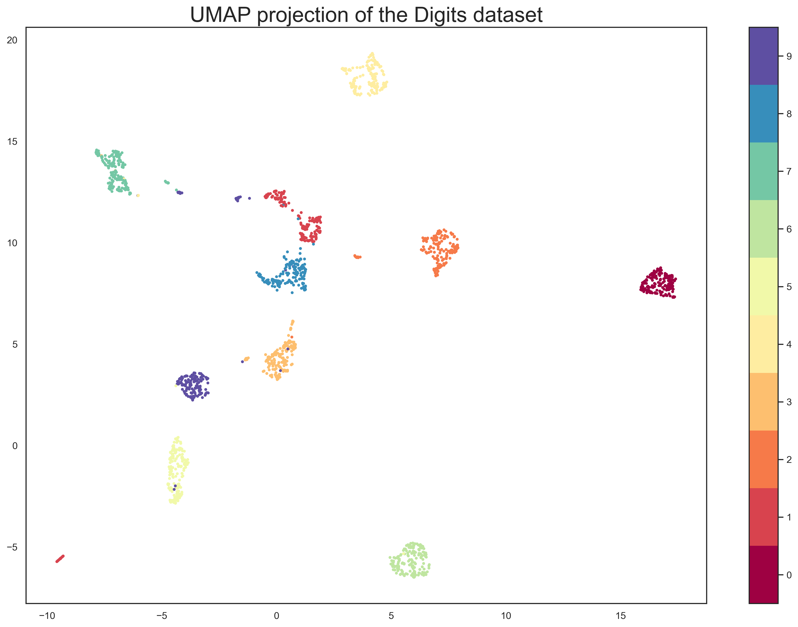

## UMAP lecture

* Student: Alexander Glötzl
* Mentor: Michael Huttner

## Why should I care about UMAP?

UMAP (Uniform Manifold Approximation and Projection) is a dimensionality reduction algorithm created by Leland McInnes. It has reached a high popularity in the machine learning community in recent years because of its fast run time and very good clustering results. \
Compared to a different dimensionality reduction algorithm, called t-SNE, UMAP shows more stable results between different runs, retains the global structure better in the low dimensional space and also has no restriction when reducing dimensionality to lower space (t-SNE can only reduce to 2D and 3D).

For example UMAP algorithm applied on the famous mnist data set looks like:




## Where to start?

The goal of the project was to design a lecture about the UMAP algorithm including exercises. \
The lecture and exercises are both located in the ./src/ directory as jupyter notebooks. The exercises were programmed in R.

## Required packages
```
packages <- c("umap")

installed_packages <- packages %in% rownames(installed.packages())

if (any(installed_packages == FALSE)) {
  install.packages(packages[!installed_packages])
}
```


